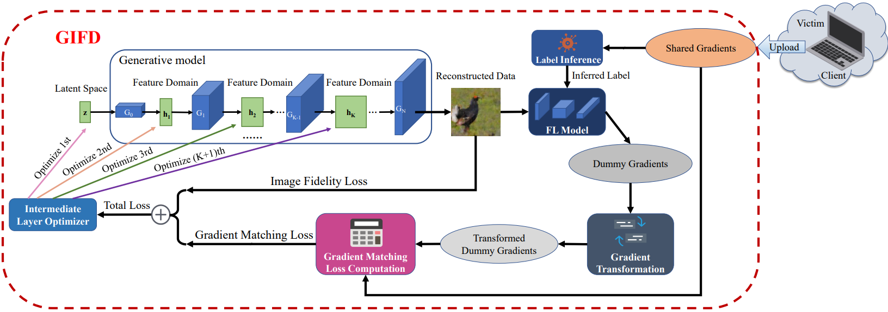
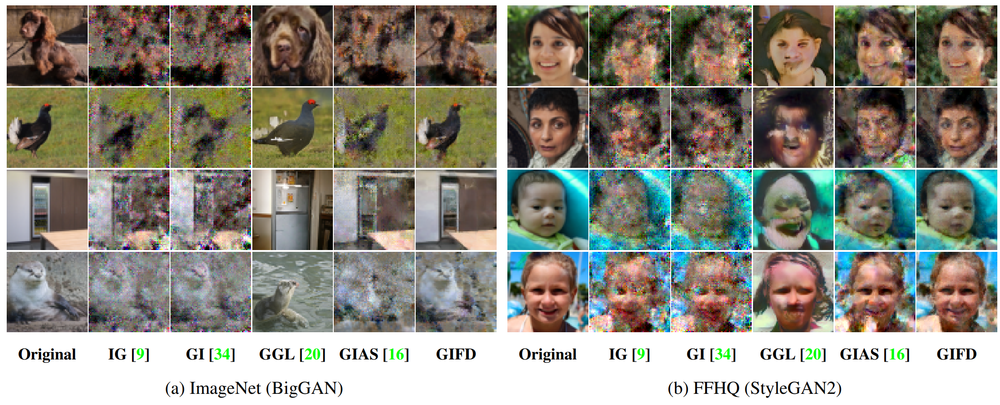

# GIFD: A Generative Gradient Inversion Method with Feature Domain Optimization
[](https://opensource.org/licenses/MIT)

A PyTorch official implementation for [GIFD: A Generative Gradient Inversion Method with Feature Domain Optimization](), accepted to ICCV-2023.



## Results


## Setup
We provide environment configuration file exported by anaconda, which can help you build up conveniently:
```bash
conda env create -f environment.yml
conda activate GIFD 
```  
## Dataset and model file
Download the [ImageNet](https://www.image-net.org/) and [FFHQ](https://github.com/NVlabs/ffhq-dataset) and provide their paths in the yml file.

While the model weights of BigGAN is downloaded automatically, StyleGAN2 need to be downloaded manually.

`gdown --id 1c1qtz3MVTAvJpYvsMIR5MoSvdiwN2DGb` (shape predictor, placed in the root directory)

`gdown --id 1JCBiKY_yUixTa6F1eflABL88T4cii2GR` (stylegan pre-trained checkpoint, placed in the inversefed\genmodels\stylegan2_io)

## Quick start
We prepare three configuration files for performing gradient inversion attacks, including the BigGAN-based, the StyleGAN2-based and the GAN-free methods. 
You can simply start by specifying the path of config file.

`python rec_mult.py --config xxxx`

## Citation

## Acknowledgement
Our code is based on [invertingGradients](https://github.com/JonasGeiping/invertinggradients) and [ILO](https://github.com/giannisdaras/ilo).

For BigGAN, we use PyTorch official [implementation and weights](https://github.com/rosinality/stylegan2-pytorch).

For StyleGAN2, we adapt [Pytorch implementation](https://github.com/rosinality/stylegan2-pytorch), which is based on the [official Tensorflow code](https://github.com/NVlabs/stylegan2).

We express great gratitute for their contribution to our community.
