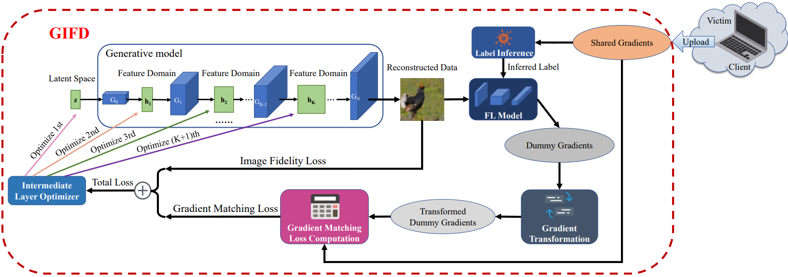
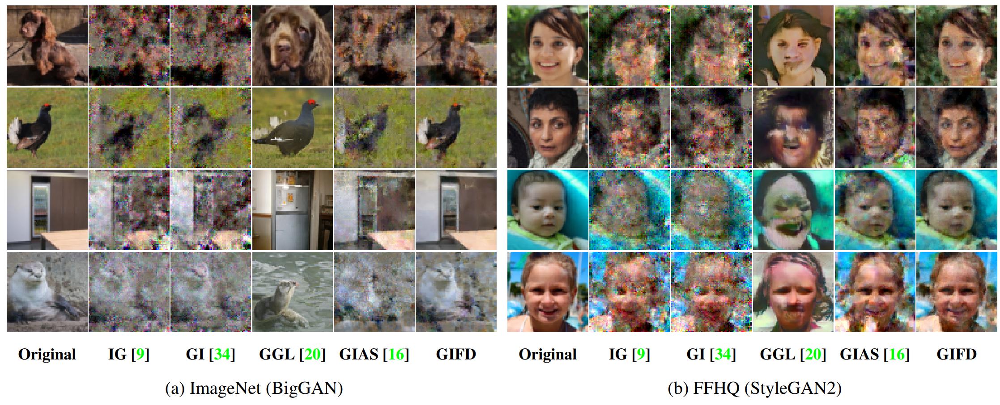

# GIFD: A Generative Gradient Inversion Method with Feature Domain Optimization
[](https://opensource.org/licenses/MIT)

A PyTorch official implementation for [GIFD: A Generative Gradient Inversion Method with Feature Domain Optimization](), accepted to ICCV-2023.



## Method

Instead of searching only the initial latent code of a pre-trained GAN, GIFD **disassembles
the generator** into `G0 o G1 o ... o GN` and progressively changes the layer being
optimized, from the initial latent space to intermediate layers closer to the output image.
Because the intermediate feature space is much larger and may lead to unrealistic image
generation, the searching range of each layer is restricted to a small **l1 ball** centered
at the vector induced by the previous layer. The output of the layer attaining the least
gradient matching loss is selected as the final reconstruction. The per-layer radii are
configured through `max_radius_*` in the yml files.

## Results


## Setup

Install the dependencies with pip (a conda environment works just as well). The
listed versions are the ones the code is verified with; only lower bounds are
enforced, so newer stacks work too.

```bash
pip install -r requirements.txt
```

`opencv-python` and `pillow` are used by the data pipelines, `lpips` by the
evaluation, and `nevergrad` by the CMA-ES baseline. `timm` is only needed for the
DeiT global models and `gdown` only to download the StyleGAN2 weights, so both
can be skipped if you do not use them.

> Note: `inversefed/genmodels/stylegan2_io/op` JIT-compiles two CUDA extensions
> (`fused_bias_act`, `upfirdn2d`) at *import* time, so a working `nvcc` matching your
> installed CUDA toolkit is required.

## Dataset and model file

Download the [ImageNet](https://www.image-net.org/) and [FFHQ](https://github.com/NVlabs/ffhq-dataset) and provide their paths in the yml file.

While the model weights of BigGAN are downloaded automatically, StyleGAN2 weights require downloading manually as follows.

```bash
# shape predictor / W+ space Gaussian fit -> place in the root directory as gaussian_fit.pt
gdown --id 1c1qtz3MVTAvJpYvsMIR5MoSvdiwN2DGb

# stylegan pre-trained checkpoint -> place in inversefed/genmodels/stylegan2_io/
gdown --id 1JCBiKY_yUixTa6F1eflABL88T4cii2GR
```

The optional StyleGAN2-ADA decoders are not shipped with the repository; if you need them,
point the `STYLEGAN2_ADA_CKPT` environment variable at a local `network-snapshot-*.pkl`.

## Supported FL models and datasets

The victim (global) model is selected with the `model` field of a config and is built by
`inversefed.nn.models.construct_model`. Besides the architectures inherited from
`invertingGradients` (`ConvNet`, the `ResNet` family, `DenseNet-121`, `MobileNet`,
`MNASNet`, ...), we additionally support:

| `model` | Source | Note |
|---|---|---|
| `AlexNet`, `VGG-16` | torchvision | |
| `ViT-Base`, `ViT-Large`, `ViT-Huge` | torchvision | patch size 16 / 16 / 14 |
| `DeiT-Small`, `DeiT-Tiny` | `timm` | install with `pip install timm` |

Transformer architectures build their positional embeddings from the input resolution, so
the image size of the FL dataset is passed to the constructor automatically. Note that the
image size must be a multiple of the patch size (e.g. `ViT-Huge` uses patches of 14 and
therefore does not accept 64 x 64 inputs).

Private datasets are selected with the `dataset` field and are built by
`inversefed.data.construct_dataloaders`: `IMAGENET_IO` (ImageNet ILSVRC 2012), `FFHQ64` /
`FFHQ128`, `CIFAR10`, `CIFAR100`, `MNIST`, `KMNIST`, `SVHN`, and the out-of-distribution
variants `OOD_FFHQ` / `OOD_IMAGENET`.

## Quick start

We prepare three configuration files for performing gradient inversion attacks, including the BigGAN-based, the StyleGAN2-based, and the GAN-free methods, where we give detailed descriptions of every parameter. Feel free to contact me at fang-h23@mails.tsinghua.edu.cn if you have any concerns.

```bash
python rec_mult.py --config configs_biggan.yml        # ImageNet 64x64, BigGAN prior
python rec_mult.py --config configs_stylegan2.yml     # FFHQ 64x64, StyleGAN2 prior
python rec_mult.py --config configs_gan_free.yml      # Geiping / Yin baselines, no GAN
python rec_mult.py --config configs_biggan_256.yml    # ImageNet 256x256, DenseNet-121
python rec_mult.py --config configs_ood_biggan.yml    # private data from a shifted domain
python rec_mult.py --config configs_ood_stylegan2.yml # face prior vs. ImageNet data
```

The last three cover the settings that go beyond the default one: higher
resolution, an out-of-distribution private domain, and the extreme case where
the generative prior (faces) shares almost no semantics with the private data
(ImageNet classes).

Metrics (PSNR, LPIPS-VGG, LPIPS-Alex, SSIM, MSE) are appended to
`<output_dir>/<exp_name>/table_Metrics.csv` and the reconstructed images are saved next to it.

Defenses are configured per experiment through `defense_method` / `defense_setting`:

| `defense_method` | Defense | Acts on |
|---|---|---|
| `noise` | additive Gaussian noise (DP) | gradient |
| `clipping` | gradient clipping by norm | gradient |
| `compression` | gradient sparsification | gradient |
| `representation` | Soteria, perturbs the representation | gradient |
| `orthogonal` | CENSOR, orthogonal subspace Bayesian sampling | gradient |
| `ats_privacy` | ATSPrivacy, searched augmentation policy | input image |

CENSOR samples `our_num_tries` gradients orthogonal to the true one and keeps
the candidate whose one-step update least increases the training loss. It is
adapted from the official [implementation](https://github.com/KaiyuanZh/censor)
following Eq. (12) of the paper. ATSPrivacy is adapted from the official
[implementation](https://github.com/gaow0007/ATSPrivacy); unlike the others it
transforms the private image instead of the gradient, so it is applied before
the shared gradient is computed.

## Evaluation helpers

Two small scripts under `tools/` reproduce the analyses that go beyond the
per-image metrics written by `rec_mult.py`.

**Significance of the improvements** (`tools/stat_test.py`). Every attack
appends one row per reconstructed image to its own `table_Metrics.csv`. Point
the script at those tables to obtain the mean and the standard deviation per
method together with a paired t-test of each baseline against a reference
method:

```bash
python tools/stat_test.py \
    --runs GIFD=results/ex1_gifd/table_Metrics.csv \
           GIAS=results/ex1_gias/table_Metrics.csv \
           GGL=results/ex1_ggl/table_Metrics.csv \
    --metric psnr --reference GIFD
```

Runs are paired on the `target_id` column when it is present and on row order
otherwise. The metric column is chosen automatically, preferring the `Best_*`
column that holds the output selected by the least gradient matching loss;
use `--column` to select one explicitly.

**Cost of one attack iteration** (`tools/profile_cost.py`). Builds the global
model with the same helper as `rec_mult.py` and reports the wall-clock time,
the forward FLOPs, the peak GPU memory and (when `pynvml` is available) the
energy of a single forward+backward pass:

```bash
python tools/profile_cost.py --model ResNet18 --resolution 64 --batch-size 2
```

FLOPs are counted for the forward pass only; the backward pass of a
convolution or a linear layer costs roughly twice as much again.

## Citation
```
@inproceedings{fang2023gifd,
  title={GIFD: A Generative Gradient Inversion Method with Feature Domain Optimization},
  author={Fang, Hao and Chen, Bin and Wang, Xuan and Wang, Zhi and Xia, Shu-Tao},
  booktitle={Proceedings of the IEEE/CVF International Conference on Computer Vision},
  pages={4967--4976},
  year={2023}
}
```

## Acknowledgement
Our code is based on [invertingGradients](https://github.com/JonasGeiping/invertinggradients) and [ILO](https://github.com/giannisdaras/ilo) and we are grateful for their great devotion.

For BigGAN, we use the PyTorch [implementation and weights](https://github.com/huggingface/pytorch-pretrained-BigGAN).

For StyleGAN2, we adapt this [Pytorch implementation](https://github.com/rosinality/stylegan2-pytorch), which is based on the [official Tensorflow code](https://github.com/NVlabs/stylegan2).

We express great gratitude for their contribution to our community!
